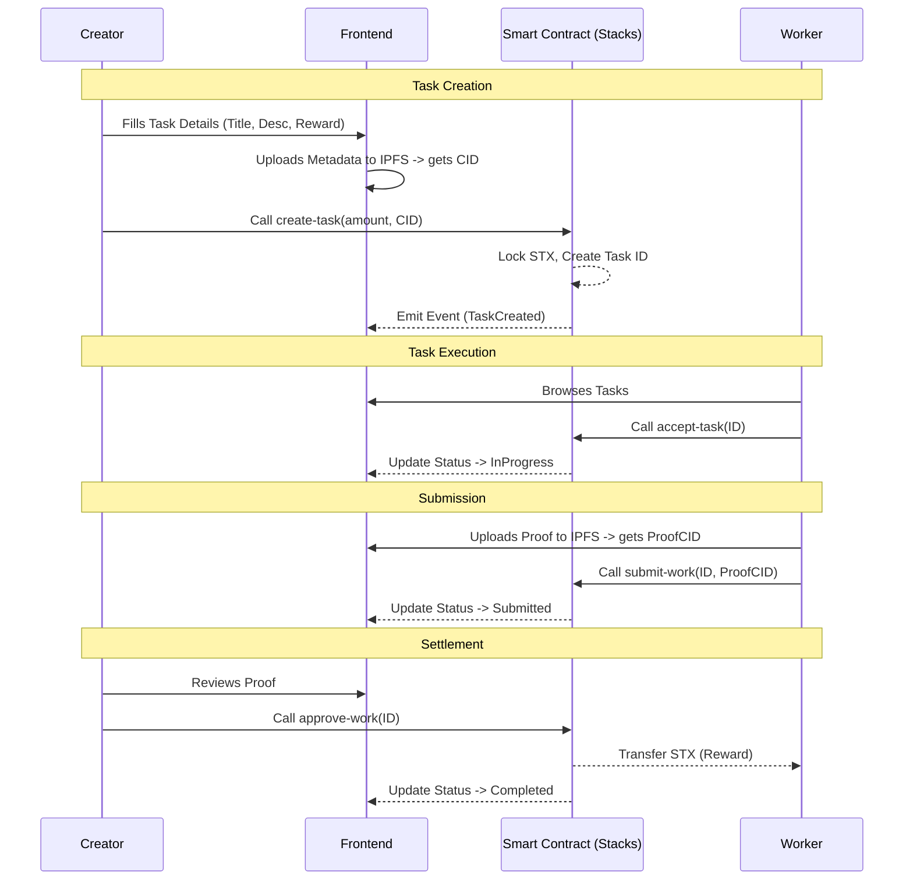

# BitStack System Architecture

## 1. High-Level Overview

BitStack is a decentralized microgigs marketplace designed to be **trustless**, **secure**, and **censorship-resistant**. It leverages the Stacks blockchain (Bitcoin L2) for value settlement and smart contract logic, while utilizing off-chain storage (IPFS/Arweave) for heavy data to maintain efficiency.

## 2. On-Chain vs. Off-Chain Responsibilities

To optimize for cost and speed while maintaining security, we separate concerns:

| Layer | Component | Responsibilities | Data Stored |
| :--- | :--- | :--- | :--- |
| **On-Chain** | **Stacks Smart Contract** (`bitstack.clar`) | • Escrow logic (holding STX)<br>• Task state management<br>• Access control (Creator/Worker)<br>• Dispute resolution triggers<br>• Payment settlement | • Task ID<br>• Creator/Worker Principals<br>• Reward Amount<br>• Status (`Open`, `InProgress`, `Submitted`, `Done`, `Disputed`)<br>• Content Hash (link to off-chain data) |
| **Off-Chain** | **Frontend / Indexer** | • User Interface (Next.js)<br>• Data Aggregation<br>• File Storage (IPFS)<br>• Notification Services | • Task Title & Description<br>• Images/Files (Proof of work)<br>• User Profiles (optional)<br>• Category/Tags |

## 3. Smart Contract Design

The core logic is encapsulated in a single Clarity contract.

### Data Structures
- **Tasks Map**: The central storage.
  ```clarity
  (define-map Tasks uint {
      creator: principal,
      worker: (optional principal),
      amount: uint,
      status: (string-ascii 20),
      data-hash: (buff 32) ;; IPFS hash of details
  })
  ```

### Key Functions
1.  `create-task(amount, data-hash)`: Locks STX, creates task entry.
2.  `accept-task(task-id)`: Assigns caller as worker, updates status to `InProgress`.
3.  `submit-work(task-id, proof-hash)`: Worker submits proof, updates status to `Submitted`.
4.  `approve-work(task-id)`: Creator approves, contract transfers STX to worker.
5.  `raise-dispute(task-id)`: Freezes funds, calls for arbitration (future scope).

## 4. Data Lifecycle & Interaction Flow



## 5. Wallet Integration

- **Authentication**: Users connect via **Leather** or **Xverse**.
- **Network**:
    - **Testnet**: For development and QA.
    - **Mainnet**: For production deployment.
- **Post-Conditions**:
    - **Strict Mode**: The frontend will construct transactions with post-conditions to guarantee that *only* the specified amount of STX is transferred from the user's wallet during `create-task`. This prevents malicious contract behavior.

## 6. Security Considerations

1.  **Escrow Safety**: Funds are held by the contract principal, not an admin. Only specific state transitions (Approve/Refund) can move them.
2.  **Timeouts**: To prevent workers from locking tasks indefinitely, we will implement a `cooldown-block-height`. If work isn't submitted by X blocks, the Creator can reclaim the task.
3.  **Reentrancy**: Clarity is decidable and non-Turing complete, eliminating reentrancy attacks by design.
